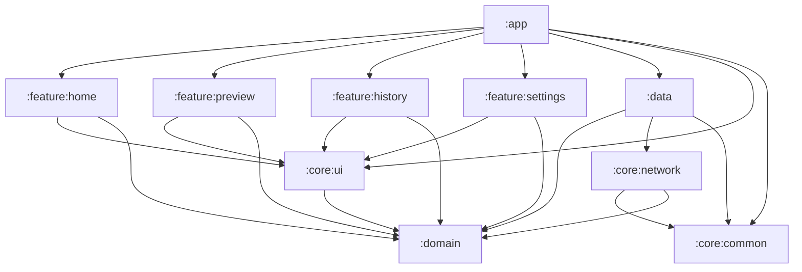
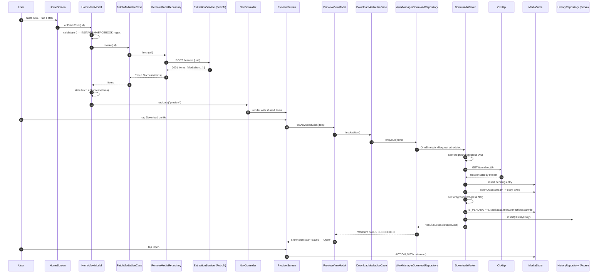
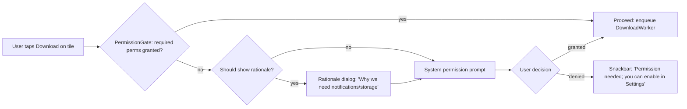

# ReelGrab — Architecture

This document describes the module layout, layered architecture, runtime
data flows, key design decisions, threading, testing, and known
follow-ups for the ReelGrab Android app. It is one of the source-of-truth
documents the `reelgrab-android-dev` agent reads before non-trivial
changes; keep it in sync when architecture moves.

---

## 1. Module diagram



Arrows point in the **compile-time dependency direction**. The `:domain`
module is a leaf and depends on nothing project-internal (only Kotlin stdlib
+ coroutines). `:app` is the only module allowed to know every other
module — it wires Hilt graphs together at the top.

---

## 2. Layered architecture

| Layer    | Modules                       | Owns                                                                                       |
|----------|-------------------------------|--------------------------------------------------------------------------------------------|
| Domain   | `:domain`                     | Pure business rules: `MediaItem`, `ErrorReason`, `FetchState`, repository interfaces, use cases. No Android types. |
| Data     | `:data`                       | Implementations of domain repositories. Owns Retrofit API, Room DB, DataStore, WorkManager glue, MediaStore writes. |
| Feature  | `:feature:home`, `:feature:preview`, `:feature:history`, `:feature:settings` | Compose screens + ViewModels. UI state holders only — no I/O. |
| Core/UI  | `:core:ui`                    | Theme, typography, dynamic-color, shared composables, error-message mapping.               |
| Core/Network | `:core:network`           | OkHttp + Retrofit + `CertificatePinner` + JSON serialization config.                       |
| Core/Common | `:core:common`             | `AppDispatchers`, `Result` shims, generic extensions.                                      |
| App      | `:app`                        | `Application`, `MainActivity`, root navigation, `AppRootViewModel`, Hilt entry points.     |

**Rules**
- A higher layer may depend on a lower layer, never the reverse.
- `:domain` is the spine — changing it is expensive and triggers test
  updates. Treat additions as API decisions.
- Features never talk to data implementations directly; they go through
  the use cases injected by Hilt against domain interfaces.

---

## 3. Data flow — happy path

User pastes a URL on Home, fetches media, navigates to Preview, taps
Download, and sees a Snackbar when the file lands in the gallery.



Key points:
- The ViewModel never sees Retrofit / Room / WorkManager directly. It
  consumes a `Flow<FetchState>` / `Flow<DownloadStatus>` from a use case.
- `DownloadWorker` survives process death; progress is delivered via
  `WorkManager.getWorkInfoByIdFlow()` rather than ad-hoc callbacks.

---

## 4. Permission flow

Permissions are requested **just-in-time**, the first time the user
attempts a download. Storage permissions are scoped to API ≤ 28; the
`POST_NOTIFICATIONS` permission is required on API 33+ for the
foreground-service notification used by `DownloadWorker`.



`PermissionGate` is implemented with `accompanist-permissions`. The
rationale string lives in `:core:ui/ErrorMessages.kt`.

---

## 5. Startup gating

On cold start the app does **not** know which destination to render until
DataStore reports whether the user has accepted the disclaimer. Choosing
the wrong start destination would cause a one-frame flash, so we gate
the `NavHost` on a nullable `StateFlow`.

```mermaid
flowchart TD
  Main[MainActivity onCreate] --> Splash[Render splash placeholder]
  Splash --> Obs[AppRootViewModel.startDestination: StateFlow<String?>]
  Obs --> Read[Read SettingsRepository.disclaimerAccepted]
  Read --> Decide{accepted?}
  Decide -- false --> SetDisc[startDestination = 'disclaimer']
  Decide -- true --> SetHome[startDestination = 'home']
  SetDisc --> Render[NavHost(startDestination = value)]
  SetHome --> Render
```

`MainActivity` composes a tiny `LaunchedEffect`-free wrapper:

```kotlin
val start by viewModel.startDestination.collectAsState()
when (val s = start) {
    null -> SplashPlaceholder()
    else -> ReelGrabNavGraph(startDestination = s)
}
```

---

## 6. Key architectural decisions

### Clean Architecture
**Why.** Isolating domain rules from Android types lets us write fast
JVM-only unit tests for `FetchMediaUseCase`, `DownloadMediaUseCase`, and
ViewModels (via fakes). 62 tests run in seconds without an emulator.

### Server-side extraction
**Why.** Instagram and Facebook frequently change their internal APIs.
Keeping extraction logic in a Node service means we can ship fixes
without forcing an app update. The Android client only knows the
`POST /resolve { url } -> MediaItem[]` contract. The `extraction-service/`
folder contains a dev stub; production is expected to be a hardened
`yt-dlp` / `instaloader` wrapper.

### MediaStore + WorkManager
**Why.** Scoped Storage (API 29+) forbids direct file-system writes
outside the app's sandbox. `MediaStore` is the only Play-policy-safe way
to put files where Google Photos will pick them up. `WorkManager` is the
only background API that survives Doze, process death, and Android 14's
foreground-service restrictions; using a `CoroutineWorker` keeps the
implementation idiomatic Kotlin.

### kotlinx.serialization (vs Moshi/Gson)
**Why.** Kotlin-first, compile-time generated, no reflection (smaller R8
output), and the same serializer works for Retrofit JSON, Room
`@TypeConverter`, and WorkManager input/output bundles. One JSON layer
for the whole app.

### `:domain` is an `android-library`, not pure-JVM
**Why.** Hilt's annotation processing emits `@Module` classes that
expect an Android classpath. Making `:domain` a `java-library` would
require a parallel non-Android Hilt configuration. The tradeoff is
slightly slower IDE indexing; we accept that for one Hilt graph.

### Ktlint rules suppressed in `.editorconfig`
**Why.** Default ktlint enforces a few opinionated rules (trailing-comma
in lambdas, multi-line param wrapping) that fight Compose's preferred
style. Rather than rewrite hundreds of composables, we disabled the
specific offending rules in `.editorconfig` with a comment pointing at
this section. The lint baseline records the remaining suppressions so
new violations still fail CI.

---

## 7. Threading model

```
+---------------------------+----------------------------------+
| Dispatcher                | Used for                         |
+---------------------------+----------------------------------+
| Dispatchers.Main          | Compose recomposition, ViewModel |
|                           | state updates                    |
| dispatchers.io            | OkHttp calls, Room queries,      |
|                           | DataStore reads/writes, file I/O |
| dispatchers.default       | JSON parsing, URL regex matching |
|                           | for very large inputs            |
| WorkManager (own pool)    | DownloadWorker — explicit IO     |
|                           | inside doWork()                  |
+---------------------------+----------------------------------+
```

- `AppDispatchers` interface in `:core:common` lets tests substitute
  `UnconfinedTestDispatcher`.
- ViewModels use `viewModelScope` and never block.
- Repository methods that touch disk/network are `suspend` and call
  `withContext(dispatchers.io) { ... }` at the boundary.
- `DownloadWorker.doWork()` runs on WorkManager's executor; it streams
  bytes synchronously inside that coroutine.

---

## 8. Testing strategy

| Scope                | Where                                            | Status               |
|----------------------|--------------------------------------------------|----------------------|
| Domain use cases     | `domain/src/test/`                               | covered              |
| Data repositories    | `data/src/test/` with `MockWebServer` + Room in-memory | covered          |
| ViewModels           | `feature/*/src/test/` with Turbine + fakes       | covered              |
| URL regex            | `domain` shared tests                            | covered              |
| Compose UI tests     | `feature/home`, `feature/preview` instrumented   | deferred (follow-up) |
| Worker tests         | `data/src/test/` with `TestListenableWorkerBuilder` | covered          |

Total: **62 unit tests**, all passing on `./gradlew testDebugUnitTest`.

CI runs detekt + ktlintCheck + `:app:lintDebug` + `testDebugUnitTest` +
`assembleDebug` and uploads the resulting APK as an artifact.

---

## 9. Open follow-ups

1. **Real extraction backend.** The current `extraction-service/` is a
   mock. Swap in `yt-dlp` / `instaloader` and pin the production TLS
   cert in `CertificatePinner`.
2. **Font assets.** Inter / Roboto Flex `.ttf` files are not yet
   shipped; typography currently falls back to the platform default
   sans-serif. Add to `app/src/main/res/font/`.
3. **Launcher icons.** Only adaptive-icon XML stubs exist; PNG
   foreground/background layers need to be produced from the brand
   palette (`#7C3AED` primary).
4. **ProGuard / R8 rules.** Retrofit, Room, kotlinx.serialization, and
   WorkManager keep-rules need to be exercised against a release build.
5. **Release signing.** `app/build.gradle.kts` reads signing config
   from `local.properties` placeholders; the real keystore is not
   checked in.
6. **Certificate pinner config.** The `CertificatePinner` is wired in
   `:core:network` but the production host fingerprint is a TODO,
   left blank until the real extraction service is deployed.
7. **Compose UI tests.** Home and Preview happy-path UI tests are
   scaffolded but not yet implemented — track in the next milestone.
